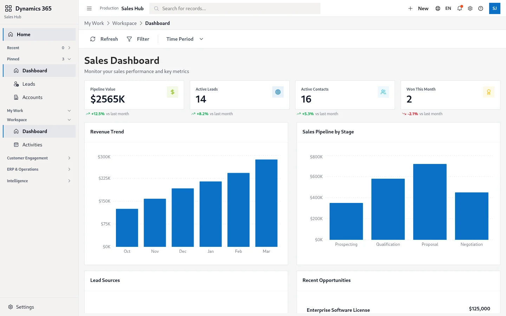
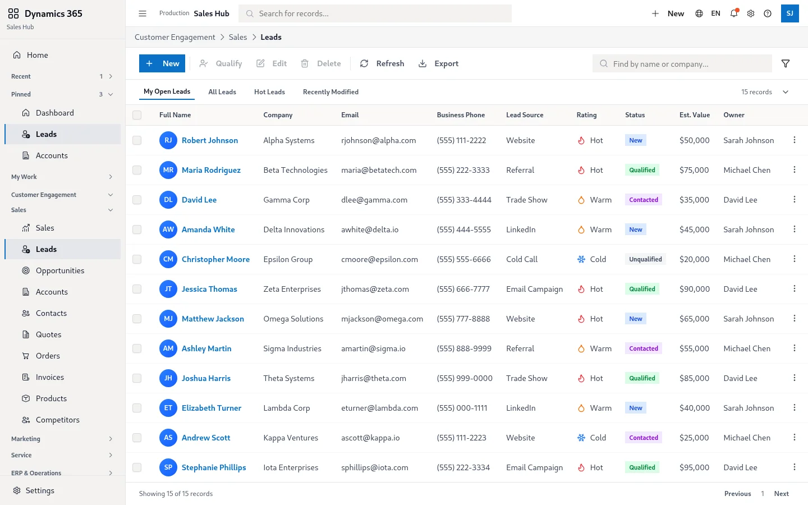
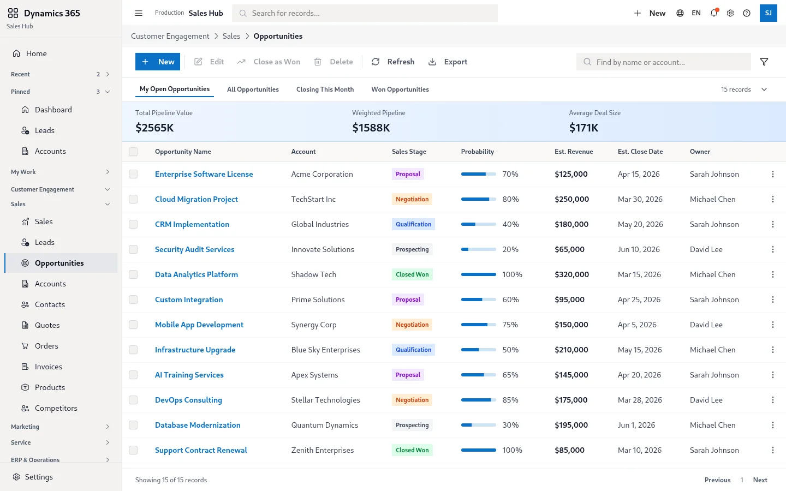
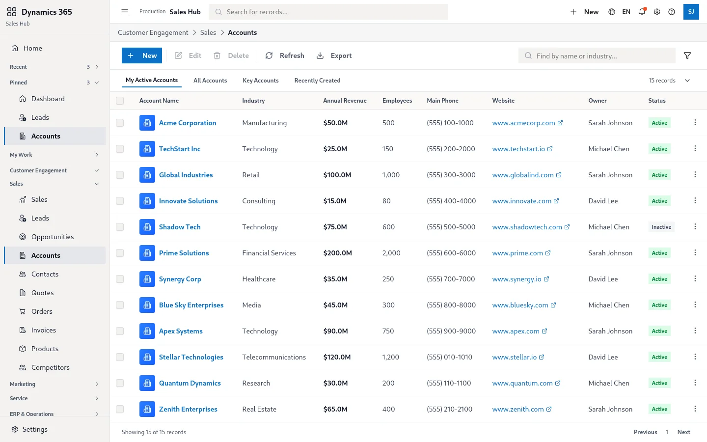
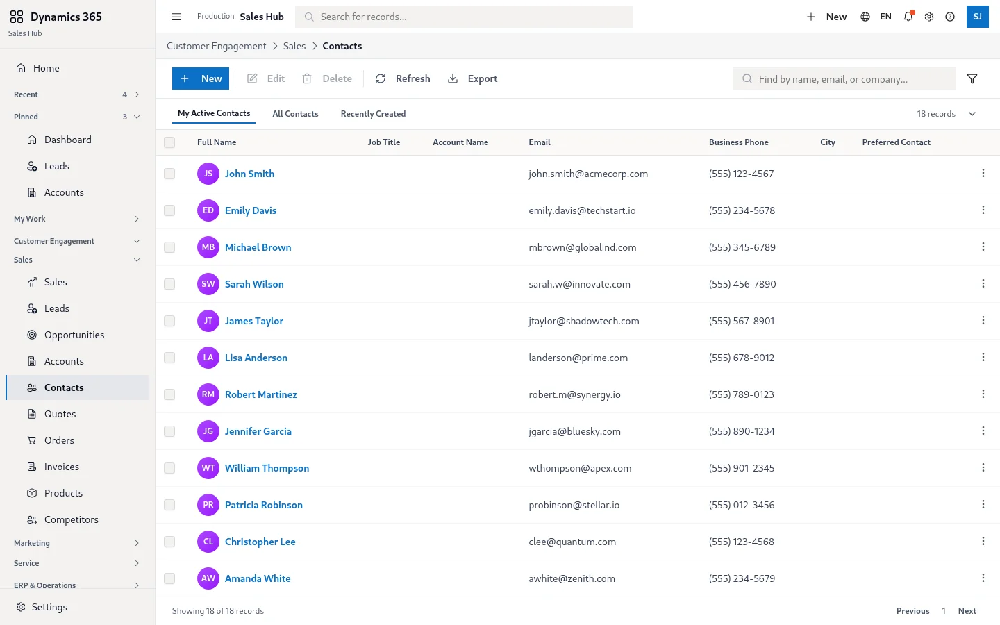
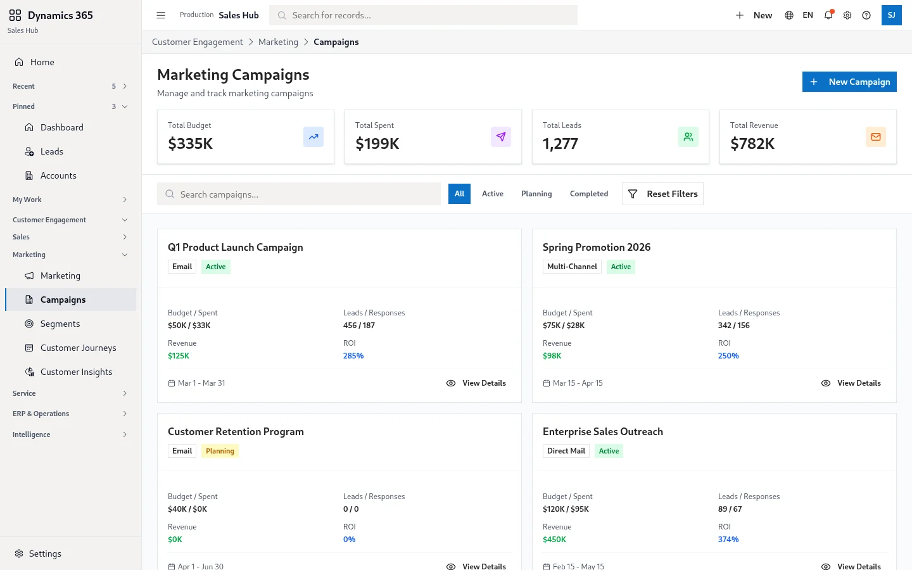
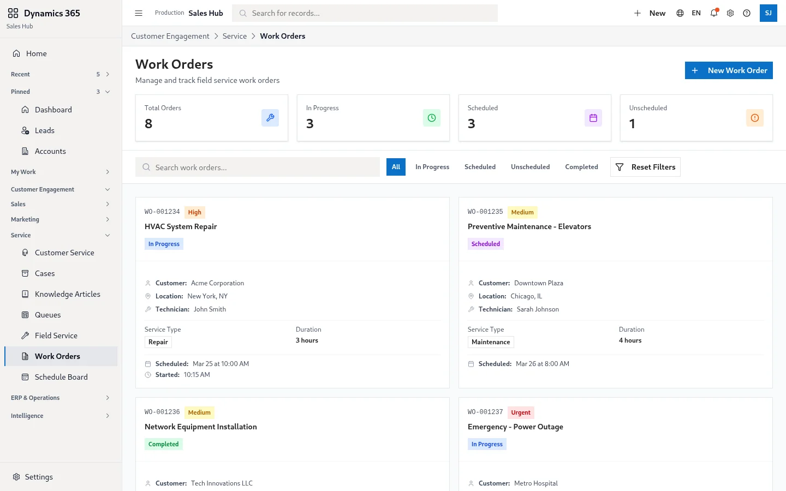
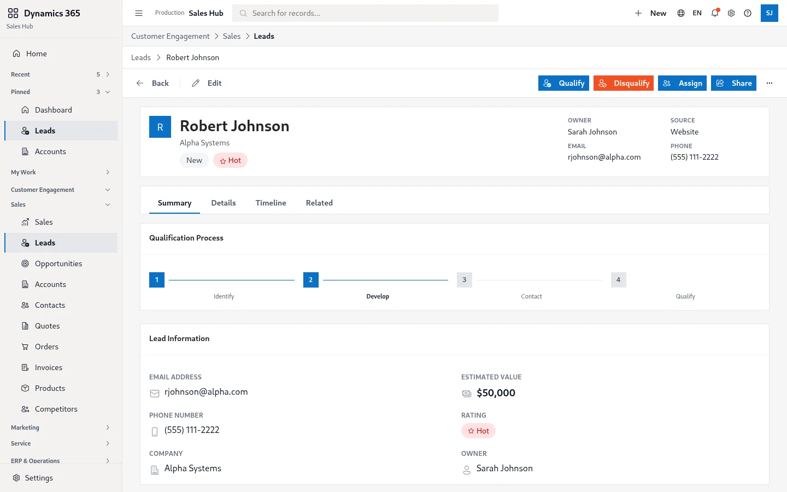

<div align="center">


# Dynamics Workspace Demo

**Microsoft Dynamics 365 stiline yakın bir CRM/ERP shell demosu** — sales, marketing, service, field service, operations, reports ve Copilot yüzeyleri tek dense bir workspace içinde.

[](#tech-stack)
[](https://dynamics.lavescar.com.tr)
[](#license)

[**▸ Live demo**](https://dynamics.lavescar.com.tr) · [**▸ Portfolyo**](https://lavescar.com.tr) · [**▸ Diğer demolar**](https://lavescar.com.tr/#projects)

</div>

---

<p align="center"></p>

## Genel bakış

Bu demo, kurumsal CRM workspace'lerinin yoğun bilgi yoğunluğunu tek bir browser-only SPA içinde temsil eder. Hedef hem ürün ekiplerine prototip referansı sunmak hem de Microsoft Fluent dil + MUI kompozisyonunun pratiğini göstermektir.

Tüm veri client-side mock'tur — gerçek bir Dataverse / OData arka ucu gerekmez. Demo, "ne kadar UI yüzeyi tek bir bundle'da pratiktir?" sorusuna cevap üretir.

## Modüller

| Yüzey | İçerik |
|---|---|
| **Dashboard** | Pipeline KPI'ları, aktivite akışı, satış kotaları |
| **Leads** | Lead listesi, filtre, detay drawer, lead skor ve aşama akışı |
| **Opportunities** | Opportunity board, kazanç tahmini, döngü süresi |
| **Accounts** | Hesap kartı, ilişkili kontak, açık fırsat ve etkinlik özeti |
| **Contacts** | Kişi listesi, çoklu seçim, drag-drop segment grupları |
| **Campaigns** | Kampanya akışı, hedef segment, KPI dashboard |
| **Work Orders** | Saha servis iş emirleri, atama matrisi, müşteri timeline |
| **Lead Detail** | Birleşik bilgi paneli, tek kart aktivite kronolojisi |

## Tech stack

| Layer | Technology |
|---|---|
| Frontend | React 18 + TypeScript + Vite |
| Component library | MUI 7 (`@mui/material`) |
| Icons | Fluent UI Icons + Lucide |
| Primitives | Radix UI (28 ayrı paket) |
| Styling | Tailwind CSS + Emotion |
| Forms | React Hook Form + Zod |
| Charts | Recharts |
| Date | date-fns |
| Deploy | Cloudflare Pages |

## Ekran görüntüleri

<table>
  <tr>
    <td></td>
    <td></td>
  </tr>
  <tr>
    <td></td>
    <td></td>
  </tr>
  <tr>
    <td></td>
    <td></td>
  </tr>
  <tr>
    <td colspan="2"></td>
  </tr>
</table>

## Hızlı başlangıç

```bash
git clone https://github.com/Lavescar-dev/microsoft-dynamics.git
cd microsoft-dynamics/app

npm install
npm run dev          # → http://localhost:5173
npm run build        # → dist/
```

## Yapı

```
microsoft-dynamics/
├── app/                  # Vite + React workspace (canonical)
│   ├── src/              # Sayfa + bileşen kaynakları
│   ├── package.json
│   └── vite.config.ts
└── docs/                 # README hero + screenshots
```

## Deploy

Cloudflare Pages doğrudan repo bağlanır:

| Field | Value |
|---|---|
| Build command | `cd app && npm run build` |
| Build output directory | `app/dist` |
| Node version | `20` |

## License

MIT © 2026 Lavescar

> **Not:** Microsoft Dynamics 365, Fluent UI ve ilgili görsel diller Microsoft'a aittir. Bu demo eğitim/portfolyo amaçlı bir UI taklididir; resmi Microsoft yazılımı veya endorsement içermez.

---

<sub>Built by **[Lavescar](https://lavescar.com.tr)** · [Portfolyo](https://lavescar.com.tr/#projects) · [efe@lavescar.com.tr](mailto:efe@lavescar.com.tr)</sub>
